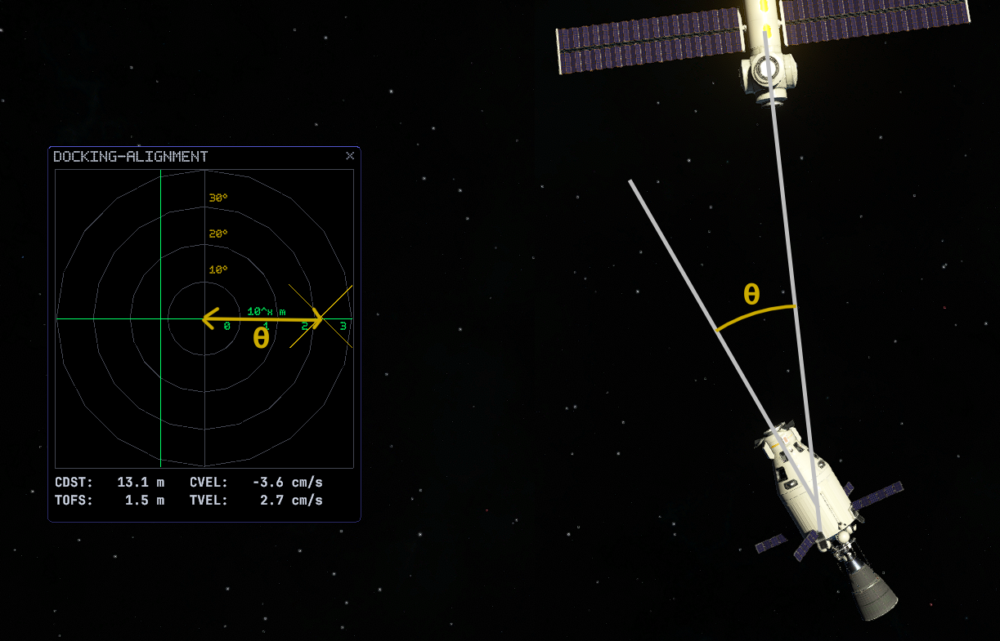
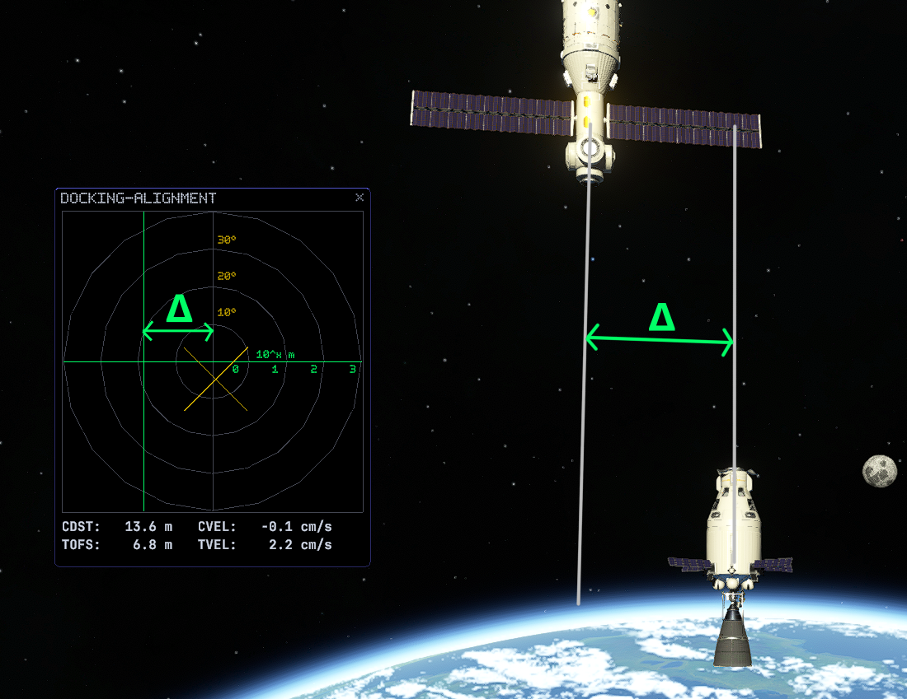

# Docking Alignement Display

Adds a new instrument providing necessary information to dock with precision.

Inspired by the great [Docking Port Alignment Indicator](https://spacedock.info/mod/543/Docking%20Port%20Alignment%20Indicator) mod for KSP1 as well as the Docking MFD from the Orbiter Game.

## Installation

**It is highly recommended to use CKAN ([Download Here](https://github.com/KSP-CKAN/CKAN)) to install Docking Alignment Display!**

### Manual Installation

1. Download the latest release of [UITK for KSP 2](https://github.com/jan-bures/UitkForKsp2/releases).
2. Drag the contents of UitkForKsp2's .zip file into your KSP2 directory, commonly located at `C:\Program Files (x86)\Steam\steamapps\common\Kerbal Space Program 2`.
3. Download the latest release of [SpaceWarp](https://github.com/SpaceWarpDev/SpaceWarp/releases).
4. Drag the contents of Space Warp's .zip file into your KSP2 directory, commonly located at `C:\Program Files (x86)\Steam\steamapps\common\Kerbal Space Program 2`.
5. Download the latest release of [Docking Alignment Display](https://github.com/Safarte/DockingAlignmentDisplay/releases).
6. Drag the contents of the mod's .zip file into your KSP2 directory, commonly located at `C:\Program Files (x86)\Steam\steamapps\common\Kerbal Space Program 2`.

## Planned features

- [x] Basic docking informations: tangent offset, misalignment, basic metrics
- [ ] Relative rotation indicator
- [ ] Relative velocity indicator
- [ ] Setting to toggle between linear and log scale for the offset indicator
- [ ] Docking Mode indicator
- [ ] Simple selector for nearby docking ports to target

## Usage

### Misalignment

The gold crosshair indicates the angle between your craft and the target docking port. If the crosshair is to the right of the center of the display, it means that you need to rotate towards the right.

When the gold crosshair is at the center of the display, you are aligned with the axis parallel to the target docking port.

### Offset

The green crosshair indicates the tangent offset between your craft and the target docking port. If the crosshair is to the left of the center of the display, it means that you need to translate towards the left.

When the green crosshair is at the center of the display, you are in front of the target docking port.

### Metrics

- **CDST (Course Distance)**: Distance from the vessel to the target docking port in the axis parallel to the target port.
- **CVEL (Course Velocity)**: Relative velocity between the vessel and the target docking port in the axis parallel to the target port.
- **TOFS (Tangent Offset)**: Distance from the vessel to the target docking port in the plane tangent to the parallel axis.
- **TVEL (Tangent Velocity)**: Relative velocity between the vessel and the target docking port in the plane tangent to the parallel axis.